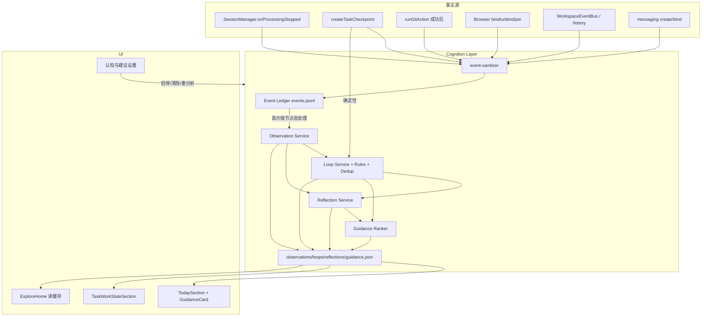

# Craft Agents v0.15.0 — 第一阶段实施计划

> 认知层 v1：工作状态引擎（Cognition Layer v1 — Work State Engine）  
> 依据：`Craft Agents v0.15.0 规划.pdf`  
> 分支：`my-changes` · 基线：`v0.14.0`  
> 日期：2026-07-23  
> 状态：**架构调研完成，待进入第二阶段（Event Ledger）**

---

## 0. 关键结论（先读）

1. **规划中的「长期任务」= 会话级任务**（`session.jsonl` header 上的 `taskGoal` / `taskPriority` / `taskDueAt` / `taskReminder*` / `taskCheckpoints`），**不是** DAG `task.yaml`（Conductor）。
2. **检查点已含 `nextSteps` / `blockers`**，且自动写入挂在 `SessionManager.onProcessingStopped`；认知层应复用，不要另起一套「会话结束摘要」。
3. **Today 是纯前端派生**（`buildTodayTasks`），Guidance 应作为增量卡片接入，默认仍克制在约 5–7 张；现有队列保留。
4. **AgentEvent（流式）权威定义在 `packages/core`**；自动化里另有同名 `AgentEvent`，禁止混用。
5. **认知衍生数据不要塞进 session header**；旁路存 `{workspaceRoot}/cognition/`。
6. **Git / 浏览器「有工作意义的状态变化」目前没有统一总线**，需在第二阶段自行 emit；会话 / 自动化缝已经够用。

---

## 1. 调研清单确认

| # | 调研项 | 结论摘要 |
|---|--------|----------|
| 1 | 任务类型及存储 | 会话长期任务在 `SessionHeader`；DAG 任务在 `tasks/<slug>/`；认知层主绑前者 |
| 2 | 检查点流程 | `createTaskCheckpoint` + `buildTaskCheckpointContent`；auto@turn 结束，manual@UI；最多 20 条 |
| 3 | Today 数据来源 | `task-today.ts` → `TodaySection`；输入为当前 workspace 的 `SessionMeta[]` |
| 4 | AgentEvent 生命周期 | Claude/Pi → EventAdapter → `AgentBackend.chat` → `SessionManager.processEvent` → `session:event` |
| 5 | 会话完成/失败/中断 | 首选挂载点：`onProcessingStopped`；辅：`emitSessionComplete` / `cancelProcessing` |
| 6 | Git 刷新入口 | `getGitRepositoryStatus` / `runGitAction`；UI 主动 refresh；无事件总线 |
| 7 | 浏览器任务绑定 | `ownerSessionId` / `boundSessionId`；持久化在 Electron `userData/browser-profile` |
| 8 | 自动化完成/失败 | `WorkspaceEventBus` + `automations-history.jsonl`；Prompt/Webhook ok 字段 |
| 9 | Mini / 摘要模型 | `runMiniCompletion` + `getMiniModel`；checkpoint 本身不调模型 |
| 10 | IPC/RPC | `packages/shared/src/protocol/` + `server-core/handlers/rpc`；勿只在 electron 定义 |
| 11 | 迁移机制 | 无统一框架；`migrationsApplied` + 域内 `schemaVersion`；认知层自带 `manifest.json` |

---

## 2. 可复用模块

| 模块 | 路径 | 认知层用法 |
|------|------|------------|
| `TaskCheckpoint` / `createTaskCheckpoint` | `sessions/types.ts` · `SessionManager` | Observation / Loop / Reflection 的确定性输入 |
| `buildTaskCheckpointContent` | `server-core/.../task-checkpoint.ts` | 已解析 nextSteps/blockers/files |
| `onProcessingStopped` / `emitSessionComplete` | `SessionManager.ts` | Session Event Ledger 主写入缝 |
| `buildTodayTasks` / `TodaySection` | `explore/task-today.ts` · `TodaySection.tsx` | 保留；旁路插入 Guidance 卡片 |
| `generateExploreBrief` | `explore-brief.ts` · `SessionManager` | 探索首页改为优先读 Guidance/Observation 缓存 |
| `runMiniCompletion` / `getMiniModel` | `AgentBackend` · `llm-connections.ts` | Observation/Reflection 模型提炼（无模型则跳过） |
| `WorkspaceEventBus` | `automations/event-bus.ts` | 自动化 / 会话状态变化事实源 |
| `Automation history` | `automations-history.jsonl` | 自动化完成/失败证据 |
| Browser `ownerSessionId` | `browser-pane-manager` · profile store | 浏览器相关 Event（仅元数据） |
| Git RPC | `services/git.ts` · `git:runAction` | 在成功 action 后写 Git Event |
| Protocol / RPC 惯例 | `protocol/channels.ts` 等 | 新增 `RPC_CHANNELS.cognition` |
| Preferences / settings UI 模式 | electron settings + preferences | 「认知与建议」开关组 |
| i18n 流水线 | `packages/shared/src/i18n` | 新文案全 locale 同步 |

---

## 3. 需要新增的模块

按规划建议组织，贴合现有 monorepo：

```
packages/shared/src/cognition/
├── types.ts                      # CognitionEvent / Observation / Loop / Reflection / Guidance
├── events/
│   ├── event-store.ts            # jsonl 追加 + 查询
│   ├── event-builder.ts          # 从会话/Git/浏览器等构造事件
│   └── event-sanitizer.ts        # 去敏：URL、无 token/cookie/diff/全文
├── observations/
│   ├── observation-service.ts
│   └── observation-prompts.ts
├── loops/
│   ├── loop-service.ts
│   ├── loop-deduplicator.ts
│   └── loop-rules.ts             # 确定性规则优先
├── reflections/
│   ├── reflection-service.ts
│   └── reflection-prompts.ts
├── guidance/
│   ├── guidance-service.ts
│   └── guidance-ranker.ts
├── storage/
│   ├── cognition-storage.ts
│   └── migrations.ts
├── settings.ts                   # 功能开关类型（映射 preferences）
└── index.ts

packages/server-core/src/cognition/
├── CognitionService.ts           # 编排：批处理、防抖、重试、无模型跳过
├── hooks.ts                      # 挂 SessionManager / Git / Automation
└── __tests__/...

packages/server-core/src/handlers/rpc/cognition.ts

apps/electron/src/
├── main/cognition/               # 若需壳侧桥接（尽量薄）
├── renderer/components/cognition/
│   ├── GuidanceCard.tsx
│   ├── EvidenceViewer.tsx
│   └── LoopActions.tsx
├── renderer/components/task-state/
│   └── TaskWorkStateSection.tsx  # 任务信息面板「工作状态」
└── （复用 today/）TodaySection 增量接入
```

存储布局：

```
{workspaceRoot}/cognition/
├── manifest.json          # schemaVersion + migrationsApplied + 诊断元数据
├── events.jsonl           # 追加式 Event Ledger
├── observations.json
├── loops.json             # 含用户手动状态（重建不可覆盖）
├── reflections.json
└── guidance.json
```

---

## 4. 数据流图



启动顺序（规划强制）：

```
读本地 cognition 缓存 → 立即渲染 Today/任务状态 → 后台检查未处理 Event → 增量更新
```

应用启动**不得**同步等待模型。

---

## 5. 文件级修改清单（按阶段）

### 第二阶段：Event Ledger

| 文件 | 操作 |
|------|------|
| `packages/shared/src/cognition/types.ts` | 新增 |
| `packages/shared/src/cognition/events/*` | 新增 |
| `packages/shared/src/cognition/storage/*` | 新增 |
| `packages/shared/src/cognition/index.ts` | 新增 |
| `packages/shared/package.json` / exports | 导出子路径（如需要） |
| `packages/server-core/src/cognition/CognitionService.ts` | 新增 |
| `packages/server-core/src/cognition/hooks.ts` | 新增 |
| `packages/server-core/src/sessions/SessionManager.ts` | 在 `onProcessingStopped` / `createTaskCheckpoint` / `setTaskDetails` / `updateSessionModel` / `createSession` 旁路 emit |
| `packages/server-core/src/services/git.ts` 或 RPC wrapper | action 成功后 emit Git Event |
| browser bind 路径（electron main 或 RPC） | bind/unbind/pin 后 emit（仅元数据） |
| automation history / event-bus 订阅 | 自动化完成/失败 emit |
| messaging gateway create/bind | 可选 emit |
| `packages/shared/src/protocol/channels.ts` + `dto.ts` + `events.ts` | `cognition:*` RPC |
| `packages/server-core/src/handlers/rpc/cognition.ts` + `index.ts` | 注册 |
| `apps/electron/.../channel-map.ts` + `types.ts` + ipc 测试 | 暴露 API |
| `packages/shared/src/cognition/**/__tests__/*` | 清洗、URL、追加查询 |

### 第三阶段：Observation + Loop

| 文件 | 操作 |
|------|------|
| `observations/*` · `loops/*` | 新增服务、规则、去重、prompts |
| `CognitionService` | 批处理、防抖、processedAt、重试、无模型跳过 |
| Loop 用户操作 RPC | continue / resolve / dismiss / convert / merge / edit next |

### 第四阶段：Reflection + Guidance

| 文件 | 操作 |
|------|------|
| `reflections/*` · `guidance/*` | 新增 |
| `explore-brief` / ExploreHome | 优先读 cognition 缓存 |
| Today 接入 Guidance | `TodaySection` / `task-today` 旁路合并排序 |

### 第五阶段：UI + 设置

| 文件 | 操作 |
|------|------|
| `GuidanceCard` · `EvidenceViewer` · `LoopActions` | 新增 |
| `TaskWorkStateSection` + SessionInfo 面板 | 新增区域 |
| preferences / settings 页 | 「认知与建议」开关组 |
| i18n locales 全量 | 新 key |
| 空/错/关闭状态 | UI |

### 第六阶段：迁移与验证

| 项 | 说明 |
|----|------|
| 旧用户升级 | 不扫全历史、不立刻调模型；「分析最近工作」按钮 |
| 关闭回退 | Today 回退现有队列；Agent 不受影响 |
| Claude / Pi / Win / mac / Linux | 统一 Event 行为 |
| 单测 / 集成 / UI 测 | 按规划第十七章清单 |

---

## 6. 事件类型清单（第二阶段落地用）

### Session
`session.created` · `session.started` · `session.completed` · `session.failed` · `session.interrupted` · `session.resumed` · `session.model_changed` · `checkpoint.manual` · `checkpoint.auto`

### Task（会话长期任务）
`task.goal_updated` · `task.priority_updated` · `task.due_updated` · `task.status_changed` · `task.completed` · `task.reopened` · `task.reminder_fired` · `task.reminder_acked`

### Git
`git.repo_detected` · `git.branch_switched` · `git.changes_present` · `git.committed` · `git.pushed` · `git.synced` · `git.pr_created` · `git.failed`  
（不记录每次 status 轮询）

### Browser
`browser.tab_bound` · `browser.tab_unbound` · `browser.task_tab_opened` · `browser.tab_pinned` · `browser.workspace_restored` · `browser.agent_acted`  
（无历史全文 / 表单 / cookie）

### Automation / Messaging
`automation.triggered` · `automation.completed` · `automation.failed` · `messaging.session_created` · `messaging.task_linked` · `messaging.attachment_saved`

---

## 7. 风险点

| 风险 | 等级 | 缓解 |
|------|------|------|
| 「Task」语义混淆（DAG vs 会话） | 高 | 代码与文档统一用 `sessionId` 作为认知 `taskId`；DAG 仅可选关联 `taskSlug` |
| 把衍生数据写入 session header | 高 | 强制旁路 `cognition/` |
| 启动时同步调模型 | 高 | 缓存优先；后台刷新 |
| Git/浏览器无事件总线导致漏记或过记 | 中 | 只在 action 成功 / bind 变更处显式 emit |
| Observation 成本过高 | 中 | 规则优先；Mini 模型；批处理；无新事件不重生 |
| Loop 刷屏 / 重复卡片 | 中 | 强去重；Today 总量 5–7 |
| 隐私泄露（URL query、diff、聊天全文） | 高 | `event-sanitizer` + 单测；诊断包脱敏 |
| 用户手动 Loop 被重建覆盖 | 高 | 持久化 `dismissed/resolved` 与用户编辑字段，重建合并策略 |
| renderer 直接调 Agent/Prompt | 中 | Prompt 只在 shared/server-core |
| 与现有 ExploreBrief 双轨建议冲突 | 中 | Explore/Today 统一读 Guidance 缓存；Brief 降级或只作补充 |
| Claude vs Pi 完成语义差异 | 中 | 只信 `onProcessingStopped` 的 reason，不信单边 adapter |
| i18n / 多平台回归 | 中 | 第六阶段清单 + validate:ci |

---

## 8. 第二阶段开工顺序（建议）

1. 落地 `packages/shared/src/cognition/types.ts` + sanitizer + event-store + 单测  
2. `cognition-storage` + `manifest` + 空迁移  
3. `CognitionService.appendEvent` + SessionManager 最小挂载（完成/失败/中断/checkpoint）  
4. RPC `cognition:getStatus` / `cognition:listEvents`（诊断用）  
5. 再扩 Git / 浏览器 / 自动化源  

**明确不做（本版本）**：全自动后台执行、多 Agent 编排、自动发消息、自动改目标、自动 commit/push、云同步、向量库、全量浏览历史、新 Backend、重做 Today 视觉。

---

## 9. 验收锚点（开发中对照）

- 会话中断 → Observation + Loop → 次日 Today「继续…」可点回任务并展开依据  
- Git 未提交 → Loop → 提交后自动 resolved  
- OAuth 失败 → blocked Loop + Guidance  
- 浏览器绑定 → 仅安全元数据进面板  
- 关闭认知开关 → 无新 Event；基础 Today/Agent 正常；可清数据重建  
