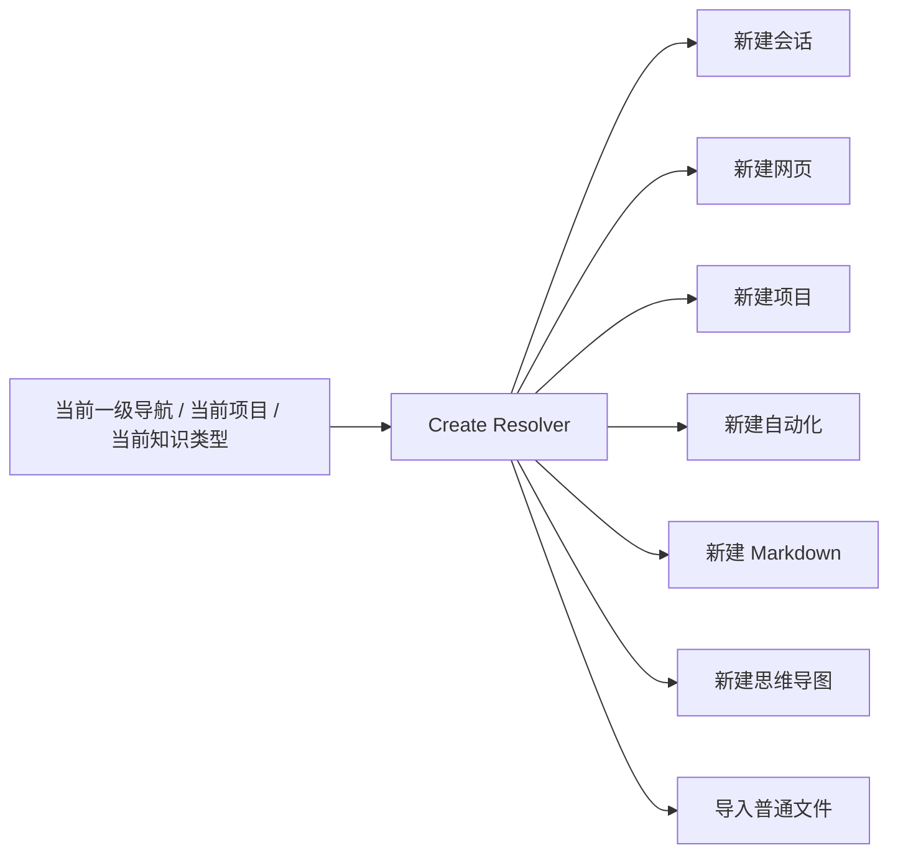
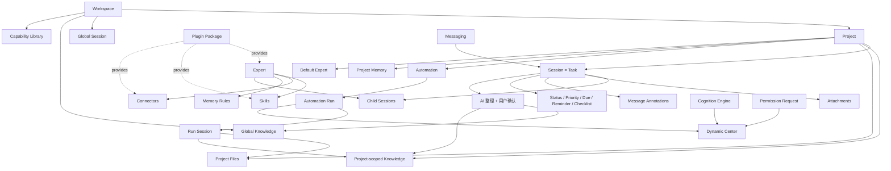
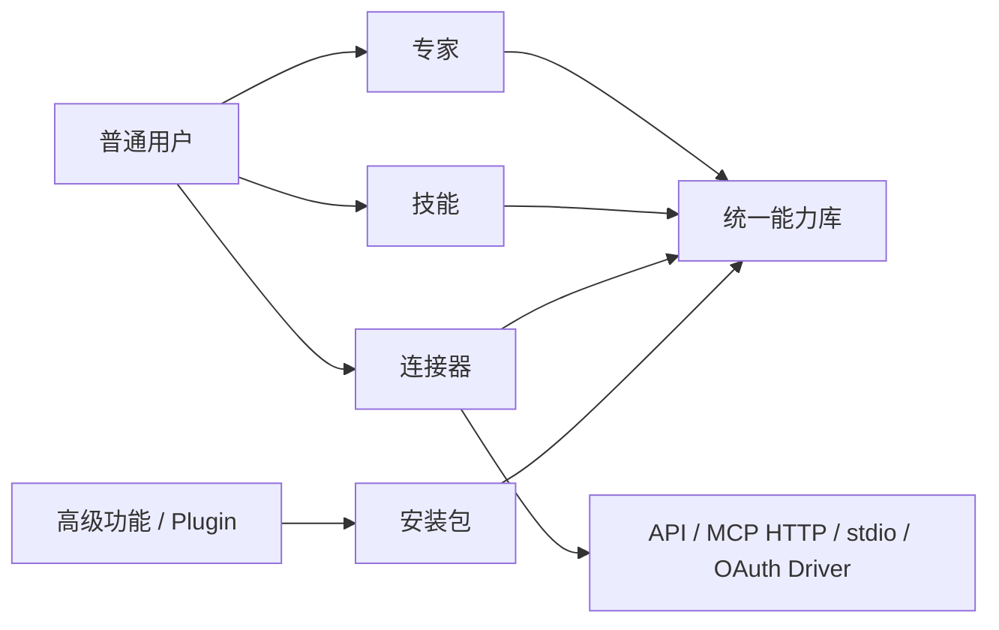
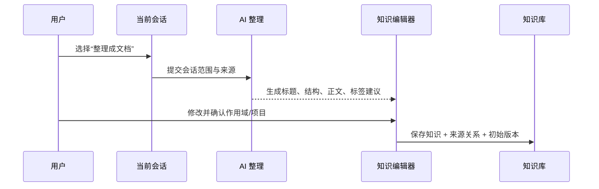
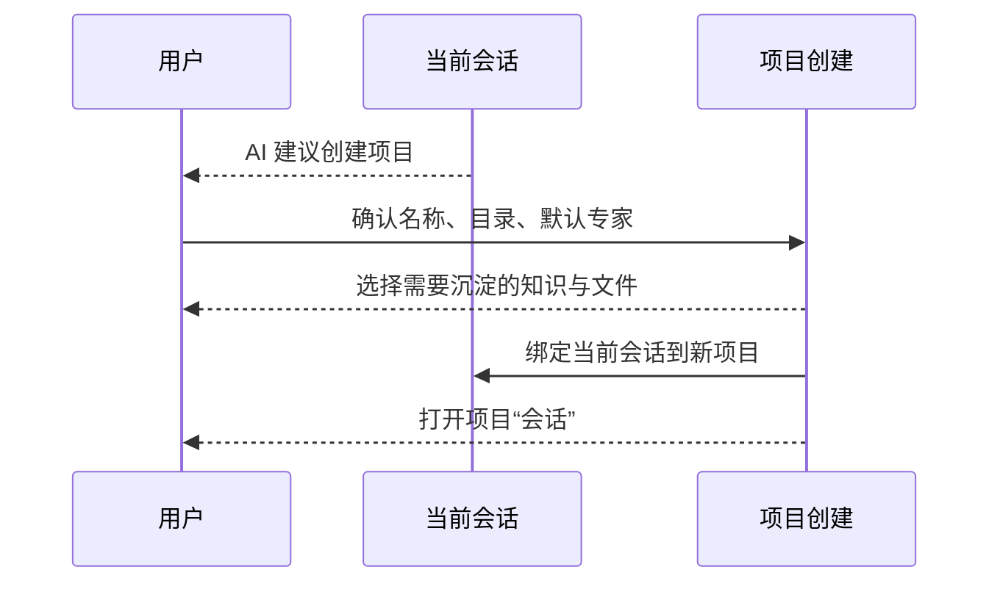
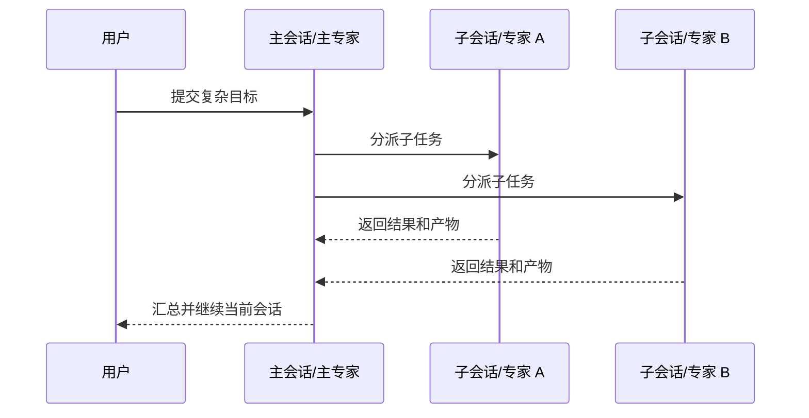
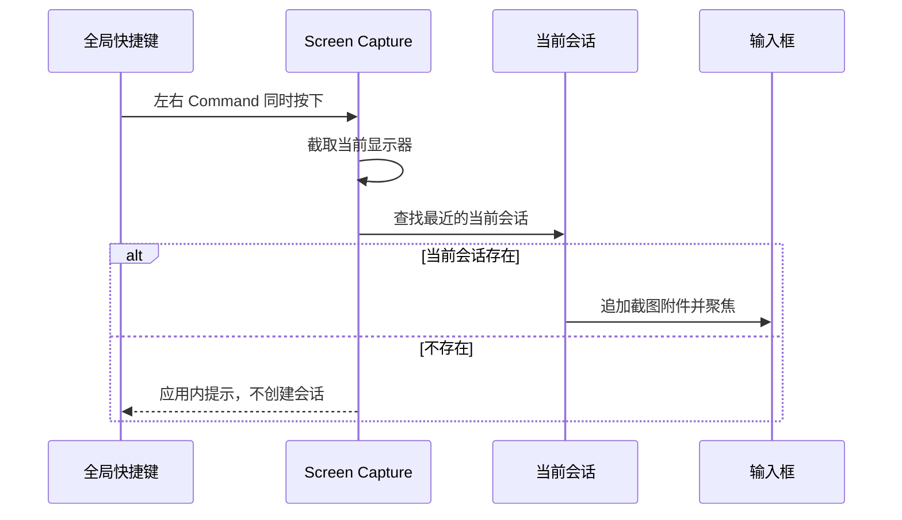

# CraftAgent v0.20.0 最终架构与实施计划

> 状态：产品决策已收口，可进入技术设计与施工拆票。  
> 决策来源：`v0.20.0-product-decisions.md` 中 195 项确认结论。  
> 代码基线：当前 `my-changes` 分支，已合入上游 v0.11.2。  
> 原则：Less is more；正式进入 v0.20 的能力必须完成，旧概念和半成品必须删除。

---

## 1. v0.20 的一句话定义

CraftAgent v0.20 是一个以**会话为统一执行单元**、以**项目承载长期上下文**、以**知识库沉淀成果**、以**自动化重复执行工作**、以**专家/技能/连接器扩展能力**的桌面 Agent 工作系统。

它不再让用户理解 Task、Session、Workflow、Source、MCP、Plugin、Library、Today、Cognition 等一组互相重叠的技术概念。

---

## 2. 最终一级信息架构

### 2.1 左侧导航

```text
新建（上下文自动路由）
会话
浏览器
项目
自动化
知识库
动态
技能

────────────
设置
（未来扩展插入点，不显示空占位）
最新动态
```

### 2.2 导航定义

| 一级入口 | 用户理解 | 默认页面 | 新建按钮 |
|---|---|---|---|
| 会话 | 对话、执行与协作；同时也是简单或复杂任务 | 最近活动会话列表 | 新建会话 |
| 浏览器 | 人工浏览、分析和 Agent 网页操作 | 浏览器标签工作区 | 新建网页 |
| 项目 | 一套长期工作的容器 | 项目列表；进入项目后默认会话 | 新建项目 |
| 自动化 | 定时、事件和可视化工作流 | 全部自动化 | 新建自动化 |
| 知识库 | 由会话沉淀、可复用和可引用的知识 | 知识列表 | 随当前类型新建 |
| 动态 | CA 内部通知中心 | 全部通知 | 无 |
| 技能 | 能力中心 | 专家 | 创建/安装当前能力 |
| 设置 | 应用和 Workspace 配置 | 通用 | 无 |
| 最新动态 | 版本日志 | 当前版本 Release Notes | 无 |

### 2.3 智能新建路由



要求：

- 主按钮始终显示具体动作，不只显示“新建”。
- 默认动作由当前上下文决定。
- 允许用户通过轻量下拉覆盖系统默认。
- 复用当前“会话 / 网页”切换后联动新建文案和行为的机制。

---

## 3. 最终核心对象模型

### 3.1 对象边界

| 对象 | 最终定义 | 不再承担 |
|---|---|---|
| Workspace | 最高层数据与权限隔离单位 | 项目管理细节 |
| Project | 长期工作容器 | 单次执行过程 |
| Session | 唯一任务/执行单元；简单对话可自然升级为复杂工作 | 长期知识存储 |
| Child Session | 专家协作、拆分执行和子任务 | 一级会话列表噪声 |
| Automation | 触发与重复执行规则 | 保存完整聊天正文 |
| Automation Run | 一次自动化运行的索引 | 独立执行存储 |
| Knowledge | 用户确认沉淀、可检索引用的内容 | 原始工作目录 |
| Project File | 工作目录文件或原始资产 | 自动变成知识 |
| Expert | 身份、模型、Skills、Connectors 和 Memory 规则的角色配方 | 协议和安装包实现 |
| Skill | Agent 完成工作的操作方法 | 外部服务连接 |
| Connector | 外部服务、API、MCP 或本地工具能力 | 用户可见的协议细节 |
| Plugin | 专家、技能、连接器的安装和分发包 | 普通用户一级概念 |
| Dynamic Item | 需要用户知道或处理的应用内通知 | 完整执行日志 |
| Memory | 用户级或项目级的持久偏好与事实 | 知识文档全文 |

### 3.2 关系图



### 3.3 Session 统一任务模型

Session Metadata 正式承载：

- `projectId`
- `parentSessionId`
- `expertId`
- `status`
- `priority`
- `dueAt`
- `reminder`
- `checklist`
- `labels`
- `referencedKnowledgeIds`
- `referencedFileIds`
- `model/connection`
- `permissionMode`
- `thinkingLevel`

规则：

- 不存在“切换成任务模式”。
- 普通会话没有任务属性时，界面仍像聊天。
- 任务属性只在右侧详情栏完整展示。
- 看板是 Session 的另一种视图，不是另一种对象。
- 自动化执行和专家协作最终也落到 Session。

### 3.4 Project

项目内部水平栏目固定为：

1. 会话
2. 知识
3. 文件
4. 自动化

项目不设概览页，不设项目 Activity 页。

项目默认上下文：

- 自动读取 Project Memory 和项目说明。
- 其他知识和文件按需检索。
- 用户可使用 `@` 明确引用。
- 项目设置一个默认专家，并可配置多个可用专家。

### 3.5 Knowledge

首批类型：

- Markdown
- 思维导图
- 普通文件

组织方式：

- 单一知识库。
- 全局/项目作用域。
- 内容类型。
- 统一 Labels。
- 搜索。
- 不做任意嵌套文件夹。

知识必须保留：

- 来源会话。
- 创建者。
- 创建和更新时间。
- 项目与作用域。
- 引用关系。
- 自动版本和恢复。

删除进入 30 天回收站。普通文件保留原件并抽取可搜索文本。

### 3.6 Expert / Skill / Connector / Plugin



作用域：

- 普通用户只配置全局、项目、专家三个作用域。
- Built-in、Plugin、Workspace、Project 等现有技术 Scope 只在诊断信息中展示。

专家协作：

- 一个主专家。
- 成员专家在子会话中工作。
- 主会话负责分配和汇总。
- 不在同一消息流中热切换身份。

### 3.7 Automation

用户可见筛选：

- 全部
- 定时
- 事件
- 工作流
- 运行记录

创建流程：

1. 用户用自然语言描述。
2. AI 判断类型。
3. 展示触发条件、权限和执行内容。
4. 用户确认或修改。
5. 保存并启用。

Workflow 采用完整节点画布，首批真实可执行节点：

- Start
- Session/Expert
- Connector Call
- Condition
- Parallel
- Knowledge Output
- Project File Output
- Approval
- End

不支持任意循环；只支持有限重试、条件和并行。

触发源：

- 定时/Cron
- 会话状态
- 文件变化
- 项目变化
- Messaging
- Webhook
- 网页变化

每次运行创建 Run Session。敏感操作进入动态中心等待批准。

### 3.8 Dynamic Center

筛选：

- 全部
- 待处理
- 自动化
- 系统

通知来源：

- 任务提醒
- 自动化结果
- Cognition 建议
- 权限/连接请求
- 系统异常

交互：

- 左侧只显示未读圆点。
- 复用现有右上角应用内通知。
- 不使用系统桌面通知。
- 点击直接打开来源。
- 普通通知 30 天；安全与失败事项保留到处理。
- 支持按项目、自动化和类型静音。

---

## 4. 关键交互流程

### 4.1 会话沉淀知识



### 4.2 从会话创建项目



### 4.3 专家拆分执行



### 4.4 双 Command 截图



---

## 5. 全局搜索

### 5.1 视觉与交互

- `Command + K` 默认打开。
- 用户可改为 `Command + Space`。
- 居中悬浮，CA 窗口背景模糊。
- 复用 CA 的颜色、Token、Icon、圆角、阴影和列表组件。
- 支持键盘选择、回车打开、Escape 关闭。

分类：

- 全部
- 会话
- 项目
- 知识
- 文件
- 网页
- 命令

### 5.2 索引

本地增量索引覆盖：

- 会话标题和消息。
- 项目。
- 知识标题、正文和抽取文本。
- 文件元数据和可抽取正文。
- 浏览器历史。
- 专家与技能。
- 设置命令。

索引必须：

- 随 CRUD 增量更新。
- 支持重建和修复。
- 在返回前执行 Workspace、Project 和权限过滤。
- 不上传远程遥测。

---

## 6. 设置最终结构

设置继续使用当前左侧设置导航骨架。

### 6.1 通用

- 应用行为
- 通知
- 更新
- 启动
- 语言
- 默认打开方式

### 6.2 AI 与记忆

- LLM Connections
- 默认模型
- Thinking
- Context Cache
- RTK
- 用户记忆
- 自动学习偏好
- 记忆来源、作用域和删除

### 6.3 外观与输入

- 主题
- Workspace 主题
- 布局
- 字体
- 输入行为
- 发送按键
- 拼写检查
- 快捷键
- 双 Command 截图

### 6.4 工作区

- 名称、图片和信息
- 数据位置
- 默认项目规则
- 默认能力
- Labels
- Statuses

### 6.5 安全与访问

- Accounts/OAuth
- 系统凭据引用
- Privacy
- Permission Rules
- Access Log

### 6.6 高级功能

- Embedded/Remote Server
- Plugin Manager
- Cognition Diagnostics
- 开发者工具
- 诊断包
- 本地使用情况

### 6.7 独立 Messaging

- 平台连接
- 凭据
- Open/Owner-only
- Binding
- Allow-list
- Pending Users

### 6.8 独立浏览器设置

- 书签
- 历史
- 下载
- 网站权限
- 浏览器扩展
- 页面/标签偏好

---

## 7. 保留、合并、改造和删除矩阵

### 7.1 保留

| 能力 | 处理 |
|---|---|
| 多 Workspace | 保持创建、查看、修改；不加删除/归档 |
| Workspace Theme | 保持现状 |
| 会话列表、筛选、Saved Views | 保留；Saved Views 只在筛选器 |
| 全局会话看板 | 保留 |
| 项目看板 | 保留并限制当前项目 |
| 会话分享 Viewer | 保留 |
| 消息批注 | 保留并明确命名 |
| 右侧浏览器 | 保留，与一级浏览器共享状态 |
| Remote Workspace/Embedded Server | 保留到高级功能 |
| Web UI | 保留 |
| Viewer | 保留 |
| Messaging | 保留独立设置 |
| Cognition Engine | 暂时保留，输出进入动态 |
| 自动更新、Deep Link、诊断 | 保留 |
| macOS/Windows/Linux | 保持现有支持 |

### 7.2 合并/改名

| 旧概念 | 新概念 | 动作 |
|---|---|---|
| Task + Session | Session | 会话承载任务属性；删除独立 Task |
| Library/资源库 | Knowledge/知识库 | 一次性迁移命名和 Schema |
| Source | Connector | API/MCP/Local/OAuth 变为内部 Driver |
| Plugin Skills + Workspace Skills | Skill Library | 隐藏五层技术 Scope |
| Today + Guidance + Reminders | Dynamic Center | 迁移有价值事件，删除 Today 产品面 |
| Accounts + Privacy + Permissions | 安全与访问 | 合并设置 |
| Appearance + Input + Shortcuts | 外观与输入 | 合并设置 |
| AI + Preferences + Memory | AI 与记忆 | 合并设置 |
| Labels + Statuses | Workspace Settings | 合并入口，保留数据 |
| Server + Diagnostics + Plugin + Cognition Debug | 高级功能 | 合并入口 |
| Browser managers | 浏览器设置 | 书签、历史、下载、权限、扩展 |

### 7.3 明确物理删除

| 删除对象 | 当前主要代码落点 | 删除前动作 | 注意 |
|---|---|---|---|
| 旧 Task 产品系统 | `packages/shared/src/tasks/`、`packages/server-core/src/tasks/`、`packages/server-core/src/handlers/rpc/tasks.ts`、Task RPC/Event/DTO、`TaskEditor.tsx`、Kanban Task 专用逻辑 | 抽取 Automation 真实需要的通用图算法 | 本机未发现 `task.yaml` 或 Task Run 数据 |
| `create_task` Agent Tool | `packages/session-tools-core/src/handlers/create-task.ts`、tool defs/context、SessionManager handler、System Prompt | 删除 Registry、Schema、Prompt 和测试 | 用“拆分执行/创建自动化/创建项目”替代 |
| `tasks:getOutput` | channels/routing/transport/server handler | 删除全部引用 | 与 Task 系统一起删除 |
| Explore 首页 | `components/explore/ExploreHome.tsx`、AppShell/MainContentPanel 路由、playground | 将通知价值迁入 Dynamic | **保留 Explore/Safe 权限模式** |
| Explore 设置 | `pages/settings/ExploreSettingsPage.tsx`、settings registry、preferences | 删除无效显示开关 | 不删除权限设置中的 Explore 术语 |
| Today 产品面 | `server-core/src/today/`、Today RPC/DTO、Explore Today UI、相关设置/i18n | 将有价值 reminder/guidance 映射到 Dynamic | Cognition Engine 暂保留 |
| Session Notes | GET/SET_NOTES RPC、SessionManager notes、相关 UI | 确认没有用户数据或提供一次性转知识入口 | 会话正文/知识替代 |
| 独立 CLI App | `apps/cli/`、workspace lock、相关文档/构建脚本 | 保留内部开发命令 | 不删除 Electron bundled helper tools |
| CA 浏览器密码管理 | `browser-password-vault.ts` 及 UI/测试 | 区分网站密码与系统 Credential Storage | Cookie/Login State 保留 |
| 旧 MCP SSE | Source 配置、验证、文案、DTO | 迁移为 Streamable HTTP | 失败配置给出明确错误 |
| Built-in Source 空概念 | Source Registry 空分支和 UI | 迁入 Connector Catalog | 不删除真实内置 Connector |
| Navigation Registry 运行时结构 | `renderer/lib/navigation-registry.ts` | 迁移仍被设置页复用的 `DetailsPageMeta` 类型 | 类型引用不等于 Registry 在运行 |
| `FEATURE_FLAGS.fastMode` | shared feature flags、network interceptor | 删除死分支和测试 | 若确认不进入 v0.20 |
| `FEATURE_FLAGS.craftAgentsCli` | permissions、prompts、pre-tool-use | 随 CLI 删除 | 清理 bundled CLI 文档差异 |
| `FEATURE_FLAGS.embeddedServer` | menu/settings visibility | 删除静态门控，改高级设置配置 | Server 实现保留 |
| `.workbuddy/` | 仓库根遗留目录 | 迁移仍有价值内容 | 然后整目录删除 |
| `apps/electron/~/` | 空目录 | 无 | 直接删除 |
| 嵌套 Shared 副本 | `apps/electron/packages/shared/src` | 清零生产/测试/打包引用 | 统一根 `packages/shared` |
| WhatsApp/Telegram 历史误导 | 旧文档/Release Notes 以外的残留 | 不改历史 Release Notes | 当前产品不展示 |

### 7.4 不删除但降级

| 能力 | 新位置 |
|---|---|
| Plugin | 高级功能 |
| Cognition Debug | 高级功能 |
| Remote Workspace | 高级功能 |
| Embedded Server | 高级功能 |
| 本地功能使用统计 | 高级功能 |
| 技术 Skill Scope | 能力详情诊断 |
| MCP 协议类型 | Connector 内部 |

---

## 8. 数据与安全迁移

### 8.1 迁移前

1. 检测当前数据 Schema 和应用版本。
2. 创建完整、版本化 Workspace 备份。
3. 校验备份可读。
4. 记录迁移 Step ID。

### 8.2 迁移项

| 旧数据 | 新数据 |
|---|---|
| Library Document | Knowledge Item |
| Library `projectId` | Knowledge Scope/Project |
| Project `MEMORY.md` | Project Memory（保持文件兼容） |
| User Preferences | User Memory/Preference |
| Source | Connector |
| Skill 5 Scope | Capability Install + Assignment |
| Flagged Session | Pinned Session |
| Today Snooze/Guidance | Dynamic State（仅迁移仍有价值数据） |
| Credentials File | OS Credential Reference |

旧 Task 无本机数据，不开发通用迁移器；安装前仍扫描本地和远程 Workspace。

### 8.3 凭据

- macOS Keychain。
- Windows Credential Manager。
- Linux Secret Service；缺失时明确降级。
- 配置文件只保存引用。
- 迁移成功并验证后安全清理旧加密副本。

### 8.4 更新备份

- 每次应用更新安装前自动备份。
- 包含应用版本和数据 Schema 版本。
- 同时保留手动备份/恢复。
- 自动备份需要上限和清理策略。

---

## 9. 代码架构拆分

### 9.1 SessionManager

目标模块：

```text
sessions/
├── session-lifecycle
├── message-service
├── session-metadata
├── session-files
├── session-sharing
├── child-session-coordinator
├── project-context-resolver
├── knowledge-reference-resolver
└── session-runtime-coordinator
```

策略：

- 只拆本阶段实际改动的领域。
- 每次抽取先锁行为测试。
- SessionManager 最终只协调，不继续吸收新业务。

### 9.2 Browser Pane Manager

目标模块：

```text
browser/
├── tab-service
├── navigation-service
├── state-persistence
├── bookmark-service
├── history-service
├── download-service
├── extension-service
├── permission-service
└── automation-adapter
```

一级浏览器和右侧浏览器共享这些服务。

### 9.3 Capability

```text
capabilities/
├── catalog
├── installer
├── assignments
├── experts
├── skills
├── connectors
├── plugin-packages
└── permission-manifest
```

### 9.4 Canvas

```text
canvas-core/
├── viewport
├── selection
├── drag
├── edges
├── shortcuts
└── history

mind-map/
└── mind-map-schema + editor

workflow/
└── executable-schema + editor + runner
```

共享交互基础设施，不共享业务 Schema。

---

## 10. 分阶段施工计划

### Phase 0：安全基线与拆除清单

交付：

- 创建 v0.20 开发分支。
- 当前数据、Git、构建和测试基线。
- 本地/远程 Task 数据扫描。
- 版本化备份原型。
- 删除对象引用图。

退出条件：

- 每个删除对象有准确引用清单。
- Explore 产品页与 Explore 权限模式边界锁定。
- 用户已有数据可备份。

### Phase 1：物理清理旧系统

工作包：

1. 删除独立 Task 产品系统和 `create_task`。
2. 删除 Explore 首页/设置，保留 Safe Permission Mode。
3. 删除 Today 产品面，保留 Cognition Engine。
4. 删除 Session Notes。
5. 删除 CLI App。
6. 删除浏览器密码管理。
7. 删除 SSE、空 Built-in Source 和静态 Feature Flags。
8. 删除遗留目录和 Shared 副本。

退出条件：

- 无死路由、死 RPC 和静态关闭正式能力。
- TypeScript、协议路由测试和打包基线恢复绿色。

### Phase 2：统一数据基础

工作包：

1. Session Task Metadata。
2. Parent/Child Session。
3. Knowledge Schema、版本、回收站和来源链。
4. Connector 统一模型。
5. Expert/Capability Assignment。
6. Dynamic Item。
7. 本地使用统计。
8. 本地增量 Search Index。
9. 系统 Credential Store。
10. Workspace Backup/Migration Framework。

退出条件：

- 新对象 CRUD 和迁移测试通过。
- 所有新服务可以无 UI 独立测试。

### Phase 3：App Shell、导航与设置

工作包：

1. 新左侧导航。
2. 上下文智能新建。
3. 左下角设置/扩展插入点/最新动态。
4. 六组设置。
5. 独立 Messaging 设置。
6. 独立浏览器设置。
7. 旧用户路由重定向。

退出条件：

- 所有正式页面可达。
- 不出现空占位和不可用开关。
- 浅色、深色和 Workspace Theme 可用。

### Phase 4：会话与项目

工作包：

1. 会话任务属性和右侧详情栏。
2. Pinned Session。
3. 消息编辑、删除和分支树。
4. 子会话和专家协作。
5. 附件汇总与项目沉淀。
6. 项目水平导航。
7. 项目自动上下文与 `@` 引用。
8. 全局/项目看板。
9. 项目归档和删除流程。

退出条件：

- 简单会话仍保持轻量。
- 复杂会话可完成状态、提醒、检查清单和子会话闭环。
- 项目数据删除不误删磁盘工作目录。

### Phase 5：浏览器与截图

工作包：

1. 一级浏览器与右侧浏览器共享服务。
2. 项目标签关联。
3. 恢复关闭标签、排序、查找、缩放、外部打开。
4. 浏览器设置页。
5. 双 Command 全局截图。
6. 跨平台快捷键和权限。

退出条件：

- 两个浏览器入口状态一致。
- 截图只进入当前会话，不自动发送/新建会话。

### Phase 6：知识、Memory 与搜索

工作包：

1. Library → Knowledge 迁移。
2. Markdown 编辑。
3. 普通文件导入、抽取和 OCR。
4. 思维导图画布。
5. 会话整理为知识。
6. 来源引用和版本对比。
7. Memory 设置。
8. `@` 引用。
9. Spotlight 式全局搜索和快速操作。

退出条件：

- 会话 → 草稿 → 知识 → 引用 → 来源会话闭环。
- 搜索索引可修复、权限正确、速度稳定。

### Phase 7：能力中心

工作包：

1. 专家数据模型和运行时。
2. 自建、复制和编辑专家。
3. 专家团队与子会话。
4. Skill 统一能力库和作用域。
5. Source → Connector 迁移。
6. 专家/技能/连接器已安装与市场。
7. Plugin 高级管理。
8. 安装权限清单和手动更新。

退出条件：

- 普通用户无需理解 Plugin、Source、MCP 或五层 Scope。
- 专家可以在项目和新会话中正常继承与覆盖。

### Phase 8：自动化与动态

工作包：

1. Dynamic Center。
2. Cognition/提醒/权限/自动化事件接入。
3. 自动化自然语言创建与类型判断。
4. 定时与 Cron。
5. 事件触发器。
6. Canvas Core。
7. Workflow Editor。
8. Workflow Runner。
9. Run Session、权限批准、重试和产出。

退出条件：

- 每一种对外展示的节点都真实可执行。
- 无 Schema-only 节点。
- 自动化失败、批准和产出全部闭环。

### Phase 9：迁移、验证与发布

工作包：

1. 完整数据迁移。
2. 凭据迁移。
3. 旧路由重定向。
4. 本地/远程 Workspace 验证。
5. 自动测试与 UI 冒烟。
6. macOS ARM/Intel、Windows、Linux 打包。
7. 更新前自动备份和失败回滚。
8. 中文文案收口。
9. Release Notes。

退出条件：满足第 12 节 Definition of Done。

---

## 11. 验证矩阵

| 领域 | 自动测试 | UI 冒烟 | 跨平台 |
|---|---:|---:|---:|
| 数据备份/迁移/回滚 | 必须 | 必须 | 必须 |
| Session Metadata/Child Session | 必须 | 必须 | 核心 |
| 消息编辑/删除/分支 | 必须 | 必须 | 核心 |
| Project 删除/归档 | 必须 | 必须 | 核心 |
| Knowledge/版本/回收站 | 必须 | 必须 | 核心 |
| Search Index | 必须 | 必须 | 核心 |
| Credential Store | 必须 | 必须 | 必须 |
| Browser 双入口 | 必须 | 必须 | 必须 |
| Screenshot Shortcut | 必须 | 必须 | 必须 |
| Expert/Skill/Connector | 必须 | 必须 | 核心 |
| Automation Trigger/Runner | 必须 | 必须 | 核心 |
| Dynamic Center | 必须 | 必须 | 核心 |
| IPC LOCAL/REMOTE Routing | 必须 | 不适用 | 必须 |
| Auto Update Backup | 必须 | 必须 | 必须 |

---

## 12. v0.20 Definition of Done

只有同时满足以下条件才能发布：

- 旧 Task、Explore 产品页、Today 产品面、Session Notes、CLI 和明确遗留代码已删除。
- Explore/Safe 权限模式未被误删。
- Library/Source/Plugin 等用户概念已完成迁移或降级。
- 新导航、智能新建、六组设置、浏览器设置全部可达。
- 会话、项目、知识、浏览器、能力、自动化、动态形成完整闭环。
- 所有正式按钮、开关、筛选和节点均真实可用。
- 没有长期静态关闭的正式 Feature Flag。
- 迁移前自动备份、迁移失败回滚可用。
- 系统凭据迁移完成。
- 核心自动测试、RPC exhaustiveness、构建和 UI 冒烟通过。
- macOS ARM/Intel、Windows x64、Linux x64 可打包。
- 浅色、深色和 Workspace Theme 可用。
- 中文文案、帮助内容和 Release Notes 完成。

---

## 13. 明确不在 v0.20 范围

- 移动 App。
- Discord。
- 系统托盘。
- 任意 Workflow 循环。
- 自动化模板和模板市场。
- 知识库任意嵌套文件夹。
- 富文本文档和表格知识类型。
- Workspace 删除/归档。
- 完整多语言同步。
- 无障碍专项验收。
- 新旧数据 Schema 长期双向兼容。

---

## 14. 第一施工入口

不要从画新页面开始。第一批 PR/Commit 应依次是：

1. `v0.20 backup + migration framework`
2. `remove legacy task product`
3. `remove explore/today product surfaces`
4. `remove cli/notes/password/dead flags`
5. `introduce session work metadata`
6. `introduce knowledge/capability/dynamic base schemas`
7. `rebuild navigation and settings shell`

这样后面的 UI 和新能力建立在新模型上，不会继续依赖准备删除的旧结构。

