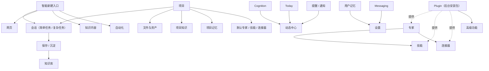

# CraftAgent v0.20.0 产品决策记录

> 状态：讨论中  
> 用途：记录已经确认的产品原则，避免后续规划和实现重新发散。

## 第一轮：产品骨架

### D-001 会话就是任务

**决定：合并。**

- 不再让用户理解“会话”和“任务”是两套对象。
- 简单对话是简单任务。
- 包含执行、工具、协作、多个步骤或持续状态的会话，是复杂任务。
- 同一个会话可以从简单对话自然升级为复杂任务。
- 原 Task 的目标、优先级、截止时间、检查点、运行状态等能力，后续并入会话模型。

### D-002 新建是上下文感知的智能入口

**决定：不采用固定的“新建会话/新建网页”选择器。**

- 新建动作跟随当前左侧一级导航、页面和容器判断默认创建类型。
- 在会话区域点击新建，默认创建会话。
- 在浏览器区域点击新建，默认创建网页。
- 在知识库中点击新建，根据当前分支创建 Markdown、文档、思维导图等内容。
- 未来新对象类型继续接入同一个入口。
- 继续复用现有“会话 / 网页”切换后联动“新建会话 / 新建网页”的机制，将路由表扩展到项目、自动化、知识内容等对象。
- 创建按钮旁可保留轻量下拉，让用户在需要时覆盖默认类型。

### D-003 项目是完整工作容器

**决定：强化项目。**

- 项目可以包含会话、文件、知识、记忆、默认能力和工作目录。
- 用户在项目中创建会话时，会话先读取项目内已授权的资源和上下文。
- 项目是“一整套东西”的容器，不只是会话文件夹。

### D-004 资源库改为知识库

**决定：改名并升级。**

- “资源库”统一改为“知识库”。
- 知识库主要保存会话产生并由用户主动沉淀的文件。
- 支持 Markdown，并为文档、思维导图等更多内容类型预留统一模型。
- 后续补充分类、检索、项目关联和语义检索。

### D-005 Memory 进入设置

**决定：新增独立的记忆设置页。**

- Memory 不作为左侧一级导航。
- 放入设置，并允许用户查看、编辑、删除记忆。
- 应展示记忆来源、更新时间和使用范围。
- Project Memory 与用户级 Memory 需要明确作用域。

### D-006 自动化成为统一一级功能

**决定：Task、Workflow、Automation 的产品入口统一为“自动化”。**

- 自动化页面内部显示任务、定时、事件、工作流和运行记录。
- 使用当前会话页右上角筛选器一类的轻量菜单手动切换，不新增大型模式切换组件。
- Task、Workflow、Automation 可以保留内部技术模型，但不再要求用户理解多个一级系统。
- Checkpoint 作为底层恢复机制，不独立暴露。

### D-007 Cognition 和 Today 并入动态中心

**决定：取消独立产品入口。**

- 动态中心采用手机通知中心的心智模型。
- Today、Cognition Guidance、任务提醒、自动化结果、连接/权限请求和系统异常统一进入“动态中心”。
- Cognition 可保留为后台机制或高级诊断功能。
- 删除 Today 独立设置和无法使用的开关。

### D-008 浏览器与会话拆分

**决定：浏览器作为左侧一级导航。**

- 浏览器不再只是会话附属面板。
- 浏览器和会话是两套清晰的工作空间。
- 仍允许会话调用和控制浏览器，但不在信息架构上强行合并。

### D-009 设置收缩为六组

**决定：设置合并。**

建议一级分组：

1. 通用
2. AI 与模型
3. 外观与输入
4. 工作区
5. 安全与访问
6. 高级功能

原则：

- 删除已失效、永远无法开启或没有产品价值的设置。
- 低频调试能力移到高级功能。
- 不为每个底层子系统单独保留一个设置页。

### D-010 Plugin 退到后台

**决定：普通用户不直接面对 Plugin。**

- 普通能力中心只展示专家、技能、连接器。
- Plugin 是安装、升级和分发这些能力的技术载体。
- Plugin 管理放入高级功能。

### D-011 Messaging 保留独立设置

**决定：继续放在设置中。**

- Messaging 不并入连接器主页面。
- 保留平台连接、频道绑定和访问控制。
- 为未来移动 App、Discord 和更多消息平台保留扩展位置。

### D-012 v0.20 采用直接清理策略

**决定：斩立决。**

- 确定不用的页面、RPC、旧数据结构和遗留目录直接删除。
- 不采取“先隐藏几个版本再删除”的保守策略。
- 删除前仍需完成引用、数据兼容和迁移检查，避免误删仍被运行时依赖的底层能力。

---

## 第二轮：信息架构与核心交互

### D-013 会话自然升级，不设置任务模式

**决定：不提供“简单 / 复杂任务”手动开关。**

- 会话始终是同一个对象。
- 普通问答是简单会话。
- 当会话开始调用工具、执行步骤、产生计划、截止时间或 Checkpoint 时，自然具备复杂任务能力。
- 复杂度是运行状态，不是用户必须提前选择的模式。

### D-014 左侧一级导航

**决定：主导航顺序如下。**

1. 新建（上下文自动路由）
2. 会话
3. 浏览器
4. 项目
5. 自动化
6. 知识库
7. 动态
8. 技能

补充：

- “技能”是普通用户进入能力中心的入口，页面内部包含专家、技能、连接器。
- 设置维持左下角入口。
- 最新动态从原位置移动到左下角。
- 左下角保留可扩展插槽，未来可加入宠物等陪伴型或辅助功能。

### D-015 项目采用轻量水平导航

**决定：项目不做第二套复杂侧栏。**

- 项目内部以会话为主要内容。
- 水平排列“会话、知识、文件、自动化”等切换项。
- 不设置低价值的项目概览页。
- 项目记忆和默认能力放入项目设置。

### D-016 项目上下文自动引用 + 手动 @ 引用

**决定：自动和手动两条路径并存。**

- 新建项目会话时，自动读取项目 Memory 和项目说明。
- 其他知识和文件按需检索，不将项目全部内容一次性塞入上下文。
- 输入框增加 `@` 引用，用于手动指定知识、文件和其他项目资源。
- 自动引用负责低摩擦，`@` 引用负责确定性和用户控制。

### D-017 知识库首批内容类型与搜索

**决定：第一批支持 Markdown、思维导图和普通文件。**

- 同时补齐知识库搜索。
- 后续增加全局搜索，交互目标类似 macOS Spotlight。
- 全局搜索计划使用 `Command + Space`，但实现前需要处理与 macOS 系统 Spotlight 的快捷键冲突和可配置性。
- 富文本文档、表格等类型后续按实际需求扩展。

### D-018 单一知识库与作用域

**决定：只保留一个知识库。**

- 知识内容主要来自会话产出和用户沉淀。
- 通过“全局 / 项目”作用域组织和筛选，而不是建设两套知识库。
- 会话是生产过程，知识库是沉淀结果。

### D-019 AI 整理后保存知识

**决定：保存前生成草稿。**

- 会话触发“整理成文档”后，由 AI 生成结构化草稿。
- 用户确认标题、作用域、内容类型和正文后写入知识库。
- 不默认把完整聊天记录原样复制成知识。

### D-020 自动化使用现有筛选器模式

**决定：克制复用。**

- 自动化内部可筛选任务、定时、事件、工作流和运行记录。
- 交互复用当前会话右上角的筛选器形态。
- 不为自动化另造复杂导航或大型切换组件。

### D-021 动态中心是通知中心

**决定：采用手机通知中心心智。**

- 首批包含任务提醒、自动化结果、Cognition 建议、连接/权限请求和系统异常。
- 普通执行完成记录默认不全部灌入，避免通知噪声。
- 后续需要定义已读、清除、分组、优先级和保留周期。

### D-022 智能新建由当前导航决定

**决定：当前一级功能就是新建上下文。**

- 选中“会话”时显示“新建会话”。
- 选中“浏览器”时显示“新建网页”。
- 选中“项目”时显示“新建项目”。
- 选中“自动化”时显示“新建自动化”。
- 选中“知识库”时，根据当前内容分支显示对应新建动作。
- 现有会话/网页下拉联动作为实现基础。

### D-023 技能入口承载能力中心

**决定：普通用户入口叫“技能”。**

- 页面顶部切换专家、技能、连接器。
- 同时展示已安装能力和市场内容。
- Plugin 仅在高级设置中管理。

### D-024 第一批直接删除

**决定：执行第一批物理清理。**

- Today 独立入口与设置。
- 旧 `tasks:getOutput`。
- 静态关闭且确定不启用的 Feature Flags。
- Navigation Registry 未使用的运行时结构；保留或迁移仍被设置页复用的类型。
- 旧 MCP SSE Transport 表达和无效配置。
- 空的 Built-in Source 概念。
- `.workbuddy` 遗留。
- 空临时目录。
- Cognition 引擎暂时保留，输出改接动态中心。

---

## 第三轮：会话、项目与搜索

### D-025 删除独立“创建任务”建议

**决定：用三个更明确的后续动作替代。**

- 创建项目：将当前主题升级为长期工作容器。
- 创建自动化：将重复或可触发的工作沉淀为自动执行。
- 拆分执行：在当前会话中创建子会话或多步骤执行。
- “整理成文档”和“继续工作”继续保留。
- 不再向用户展示含义重叠的“创建任务”。

### D-026 AI 可以建议创建项目

**决定：建议但不自动创建。**

- 当 AI 判断当前主题需要多次会话、多个文件或长期维护时，可以建议创建项目。
- 用户确认项目名称、位置和首批资源后再创建。
- AI 不得在没有确认的情况下自动制造项目。

### D-027 会话保留任务属性

**决定：会话直接承载任务管理能力。**

- 状态
- 优先级
- 截止时间
- 提醒
- 检查清单

这些属性按需显示。普通对话不应因为字段过多而显得像项目管理软件。

### D-028 项目水平栏目

**决定：顺序固定为：**

1. 会话
2. 知识
3. 文件
4. 自动化

不增加项目概览页。

### D-029 项目知识是统一知识库的筛选结果

**决定：不复制知识数据。**

- 全局知识库与项目内“知识”使用同一份数据。
- 项目页面自动筛选 `projectId` 为当前项目的知识。
- 知识可变更作用域或项目归属，但不因进入项目而产生副本。

### D-030 全局搜索范围

**决定：首批检索以下对象。**

- 会话
- 消息
- 项目
- 知识
- 文件
- 浏览器历史
- 技能
- 设置命令

自动化运行记录与动态通知暂不进入首批搜索范围。

### D-031 全局搜索快捷键

**决定：默认使用 `Command + K`。**

- 用户可在快捷键设置中改为 `Command + Space`。
- 若 `Command + Space` 被 macOS Spotlight 占用，应明确提示冲突，不静默失败。
- 左侧搜索按钮和键盘快捷键打开同一个全局搜索界面。

### D-032 左下角扩展规则

**决定：不展示空占位。**

当前顺序：

1. 设置
2. 最新动态（固定在最底部）

布局约束：

- 在“设置”和“最新动态”之间保留若干内部扩展插入点。
- 当前没有功能时，UI 不显示占位、空白槽、虚线框或“即将推出”。
- 未来宠物、小组件或其他功能插入这些位置。
- 最新动态始终保持最底部位置。

---

## 第四轮：统一执行模型与搜索体验

### D-033 会话只归属一个项目

**决定：单项目归属。**

- 一个会话最多绑定一个项目。
- 会话可通过 `@` 引用其他项目的知识和文件。
- 引用其他项目资源不会改变会话自身的项目归属。

### D-034 从会话创建项目

**决定：当前会话随项目一起建立。**

- 当前会话自动归入新项目。
- 创建时让用户选择要沉淀到项目的知识和文件。
- 未选择的会话附件不自动复制。

### D-035 拆分执行使用子会话

**决定：主会话负责调度与汇总。**

- 拆分后创建多个子会话。
- 子会话默认不挤入一级会话列表。
- 主会话展示子会话状态、结果和失败原因。
- 用户需要时可以进入单个子会话查看完整过程。

### D-036 自动化运行产生会话

**决定：所有 Agent 执行统一落到会话。**

- 每次自动化运行创建运行会话。
- 自动化记录负责触发配置和运行索引。
- 完整过程、工具调用、权限与产出继续由会话承载。
- 动态中心只接收需要关注的运行结果，不重复保存执行正文。

### D-037 全局会话保留看板

**决定：列表为默认视图，看板作为筛选菜单中的可选视图。**

- 全局会话页保留列表与看板。
- 复用现有会话筛选菜单切换看板，不新增一级入口。
- 项目内会话同样可以使用看板，并自动限制为当前项目范围。
- 全局看板用于跨项目查看工作状态，项目看板用于管理单一项目。

### D-038 任务属性展示方式

**决定：只放在右侧详情栏。**

- 状态、优先级、截止时间、提醒和检查清单不占用会话正文顶部。
- 普通对话默认不会看到任务管理表单。
- 用户需要管理复杂会话时，从右侧详情栏查看和修改这些属性。
- 会话列表和看板可以显示必要的紧凑摘要，例如状态、优先级和截止时间。

### D-039 全局搜索为模糊背景悬浮层

**决定：参考 macOS Spotlight 的信息布局，不复制其视觉。**

- 搜索界面居中悬浮。
- 打开时对 CraftAgent 当前窗口内容做背景模糊和弱化。
- 结果采用搜索输入、分类筛选和混合结果列表结构。
- 视觉全部复用 CraftAgent 的颜色、圆角、阴影、排版、Icon 和现有组件。
- 不为搜索单独编写一套脱离 CA 的设计系统。
- 支持键盘上下选择、回车打开和 Escape 关闭。

### D-040 全局搜索提供快速操作

**决定：搜索同时是轻量命令入口。**

- 新建对象。
- 打开结果。
- 归档会话。
- 进入项目。
- 引用知识。
- 打开设置命令。

破坏性操作不直接在首层结果执行，应进入确认或详情流程。

### D-041 动态中心通知管理

**决定：**

- 按“今天 / 更早”分组。
- 支持单条已读、全部已读和单条清除。
- 普通通知保留 30 天。
- 安全、权限和失败事件保留到用户明确处理。

### D-042 不迁移旧 Task 数据

**决定：v0.20 不建设旧 Task 迁移链路。**

- 删除旧 Task 产品入口和数据模型时，不把旧 Task 转换为会话或自动化。
- 2026-07-26 对本机 `~/.craft-agent` 的只读检查未发现任何 `task.yaml`、Task 目录或 Task Run 数据。
- 在正式删除前仍执行一次相同检查；若其他机器或远程 Workspace 存在旧 Task，由用户先导出或直接放弃。

---

## 第五轮：知识、搜索与设置

### D-043 右侧会话详情栏是统一控制面板

**决定：右侧详情栏包含：**

- 状态、优先级、截止时间、提醒和检查清单。
- 所属项目。
- 标签。
- 引用的知识、文件和其他资源。
- 会话文件。
- 子会话及其运行状态。
- 当前模型与连接。
- Permission Mode。
- Thinking Level。

会话正文保持专注于对话和执行过程，低频控制项不占据正文顶部。

### D-044 知识草稿在完整编辑页确认

**决定：**

- “整理成文档”后进入知识库完整编辑页。
- AI 预先生成标题、结构、正文、来源和建议作用域。
- 用户确认或修改后再正式保存。
- 不使用空间不足的小弹窗承载长文档编辑。

### D-045 思维导图使用结构化节点模型

**决定：第一版提供可编辑思维导图。**

- 节点可新增、修改、删除。
- 支持折叠和拖动调整结构。
- 采用结构化 JSON 作为权威存储，不以图片作为源文件。
- 支持导出图片和 Markdown。
- 具体 Canvas/编辑器组件在技术设计阶段选型。

### D-046 知识保留完整来源链

**决定：每条知识记录：**

- 来源会话。
- 创建者。
- 创建时间与更新时间。
- 引用关系。
- 作用域和所属项目。

用户可以从知识详情一键返回原会话。后续 AI 使用知识时也应能解释来源。

### D-047 全局搜索分类

**决定：顶部分类为：**

1. 全部
2. 会话
3. 项目
4. 知识
5. 文件
6. 网页
7. 命令

布局参考 macOS Spotlight 的信息层次，视觉继续使用 CraftAgent 组件和样式。

### D-048 动态与最新动态是两个对象

**决定：**

- 左侧“动态”是通知中心，展示提醒、自动化结果、权限请求和异常。
- 左下角“最新动态”是版本更新、Release Notes 和产品公告。
- 两者的数据源、已读状态和生命周期完全分开。

### D-049 设置分组改为“AI 与记忆”

**决定：Memory 并入 AI 设置组。**

- 设置组名称为“AI 与记忆”。
- 包含模型连接、默认模型、Thinking、Context Cache、用户记忆及其来源/作用域管理。
- 项目记忆仍由项目设置管理，但可以从用户记忆页查看作用域关系。

### D-050 Cognition 退到后台和高级诊断

**决定：**

- 普通设置删除 Cognition 独立入口。
- Cognition 引擎暂时保留，为动态中心提供建议。
- 事件、Observation、Loop、Reflection、Guidance 等调试视图移入“高级功能”。
- 若后续使用价值仍然不足，再删除引擎，不让内部模型重新成为一级产品概念。

---

## 第六轮：专家、技能与连接器

### D-051 专家是完整角色配方

**决定：专家包含：**

- 身份与系统提示词。
- 头像、名称和简介。
- 默认模型与连接。
- 默认 Skills。
- 默认 Connectors。
- Memory 使用规则。
- 工作方式和协作规则。

专家不是一段孤立 Prompt，而是一套可启动、可复制、可安装的 Agent 配置。

### D-052 新会话可以选择专家

**决定：**

- 未选择时使用通用助手。
- 用户可从输入框或新建菜单选择专家。
- 选择专家不增加强制的新建步骤。
- 项目存在默认专家时，新会话优先继承项目默认值。

### D-053 专家协作通过子会话

**决定：当前会话的主专家不直接热切换。**

- 主专家可以邀请其他专家执行子任务。
- 被邀请专家运行在子会话中。
- 主会话负责汇总结果并保留协作关系。
- 避免同一消息流中角色身份、Memory 和权限不断变化。

### D-054 项目配置默认专家与可用专家

**决定：**

- 每个项目可以设置一个默认专家。
- 项目可以配置多个可用专家。
- 项目内新会话自动继承默认专家。
- 用户仍可在新建时覆盖默认选择。

### D-055 支持自定义专家和复制

**决定：**

- 用户可以通过向导创建自己的专家。
- 可配置角色描述、模型、技能、连接器和 Memory 规则。
- 支持复制已安装专家后修改。
- 内置、市场和自建专家使用同一运行模型。

### D-056 专家团队采用主从协作

**决定：**

- 一个主专家负责理解目标、分配工作和汇总结果。
- 多个成员专家通过子会话执行。
- 主专家根据任务需要决定何时拆分。
- 团队不是多个专家在同一聊天里轮流抢答。

### D-057 Skill 使用统一能力库和作用域

**决定：**

- Skill 先安装到统一能力库。
- 用户可在全局、项目或专家作用域启用。
- 普通 UI 不展示 Built-in、Global、Plugin、Workspace、Project 五层技术 Scope。
- 详情页仍显示来源、继承和覆盖关系，便于诊断。

### D-058 Source 在 UI 统一为 Connector

**决定：**

- 用户只面对“连接器”。
- API、MCP、Local、OAuth 是连接器内部的驱动或认证类型。
- 现有 Source 配置和凭据能力迁入 Connector 模型。
- MCP 继续作为协议存在，不再成为一级产品概念。

### D-059 市场嵌入三个能力标签

**决定：**

- 专家、技能、连接器三个标签页各自包含“已安装 / 市场”。
- 不创建独立第四个市场一级页面。
- 搜索、分类、安装和更新采用一致交互。

### D-060 Plugin 只在高级管理页出现

**决定：Plugin 高级页展示：**

- 安装包名称和版本。
- 安装来源。
- 可用更新。
- 启用/禁用。
- 卸载。
- 权限。
- 安装包所提供的专家、技能和连接器。

普通用户从能力对象出发，不需要先理解 Plugin。

---

## 第七轮：设置合并与旧系统清理

### D-061 设置保持现有导航骨架

**决定：**

- 设置继续使用左侧分组导航。
- 一级收缩为六个主要分组。
- 组内使用水平标签或子页面切换。
- 不改成卡片首页，也不使用多层折叠菜单。

### D-062 通用设置

**决定：“通用”包含：**

- 应用行为。
- 通知。
- 更新。
- 启动。
- 语言。
- 默认打开方式。

输入、快捷键和外观不混入通用。

### D-063 外观与输入

**决定：“外观与输入”包含：**

- 主题。
- 布局。
- 字体。
- 输入行为。
- 发送按键。
- 拼写检查。
- 快捷键。

原 Appearance、Input 和 Shortcuts 页面并入同一设置组。

### D-064 安全与访问

**决定：“安全与访问”包含：**

- 账号与 OAuth。
- 凭据。
- 隐私。
- 权限。
- 访问日志。

删除 Accounts、Privacy、Permissions 三个彼此割裂的一级设置概念。

### D-065 Messaging 保持独立设置入口

**决定：**

- Messaging 不塞进六个通用设置分组。
- 保留独立入口，承载消息平台、频道绑定、访问控制和未来移动端接入。
- 后续可扩展 Discord 等平台。

### D-066 Workspace 设置

**决定：“工作区”包含：**

- 工作区名称、图片和信息。
- 默认项目规则。
- Labels。
- Statuses。
- 默认能力。
- 数据位置。

Labels 和 Statuses 不再作为独立设置页。

### D-067 高级功能正常可见

**决定：**

- 高级功能位于设置列表最底部。
- 不采用点击版本号解锁的隐藏方式。
- 包含 Server、Plugin、Cognition 诊断、开发者工具和诊断信息。

### D-068 删除 Explore

**决定：**

- 删除 Explore 设置页。
- 删除旧 Explore 产品页面和导航概念。
- 搜索能力进入全局搜索。
- 建议进入动态中心。
- 会话/网页等创建能力进入上下文智能新建。

### D-069 Preferences 并入 AI 与记忆

**决定：**

- 保留 Agent 自动学习的偏好数据。
- 偏好统一显示和管理于“AI 与记忆”。
- 删除重复的 Preferences 独立设置页。

### D-070 删除旧 Task 产品系统

**决定：删除：**

- TaskEditor。
- `create_task` Agent Tool。
- Task RPC。
- `task.yaml` 存储。
- Task 专用数据模型和产品入口。

现有 DAG 代码不因“可能有用”而整体保留。只有 Automation 技术设计确认需要的通用部分才抽取、改名并保留。

---

## 第八轮：自动化、知识库与通知

### D-071 自动化不再显示“任务”

**决定：筛选项为：**

1. 全部
2. 定时
3. 事件
4. 工作流
5. 运行记录

会话已经是任务，不在自动化里重新建立同名概念。

### D-072 AI 自动判断自动化类型

**决定：**

- 用户通过自然语言描述想自动完成的事情。
- 系统判断应创建定时、事件或工作流。
- 创建结果必须清楚显示判断出的类型、触发条件和执行内容，用户确认后保存。
- 编辑器仍允许用户手动更改系统判断。

### D-073 Workflow 首版使用完整节点画布

**决定：不以步骤列表作为首版终点。**

- 提供可缩放、拖动和连线的节点画布。
- 首批覆盖顺序、条件、并行、专家/会话执行、连接器调用和产出节点。
- 画布使用 CraftAgent 设计系统，不引入独立视觉语言。
- 实现前必须先定义可真实执行的节点集合；不复刻旧 Task 中只有 Schema、Runner 无法执行的空节点。

### D-074 定时自动化

**决定：支持：**

- 常用周期。
- 指定日期与时间。
- Cron 高级模式。

### D-075 事件自动化首批触发源

**决定：支持：**

- 会话状态。
- 文件变化。
- 项目变化。
- 消息平台。
- Webhook。
- 浏览器网页变化。

网页变化需要明确监控页面、检测规则和频率，不能依赖持续可见的浏览器标签。

### D-076 自动化权限

**决定：每条自动化拥有 Permission Mode。**

- 安全操作可以自动执行。
- 敏感操作进入动态中心等待批准。
- 权限策略应在保存和启用前清楚展示。

### D-077 自动化失败

**决定：**

- 支持配置有限重试次数。
- 最终失败进入动态中心。
- 保留完整运行会话、错误节点和失败原因。
- 不允许无限重试。

### D-078 自动化产出

**决定：**

- 完整执行过程保存在运行会话。
- 文档类产出可写入知识库。
- 文件类产出进入项目文件。
- 自动化配置只保存规则和运行索引，不复制全部产出。

### D-079 不提供自动化模板

**决定：**

- v0.20 不建设内置模板或模板市场。
- 自动化仅由用户手动发起创建。
- AI 可以帮助把用户描述转换成自动化，但不能向用户推送预制模板。

### D-080 知识库布局

**决定：**

- 默认使用列表。
- 可切换卡片视图。
- 使用作用域、项目、类型和标签筛选。
- 首版不采用复杂文件夹树。

### D-081 不做任意文件夹

**决定：**

- v0.20 不做嵌套文件夹。
- 依靠全局/项目作用域、内容类型、标签和搜索组织知识。
- 避免再次制造一套与项目、文件、标签重叠的层级系统。

### D-082 知识复用统一 Labels

**决定：**

- 复用现有标签系统。
- 不为知识库创建第二套标签。
- AI 可以建议已有标签或建议创建新标签，最终由用户确认。

### D-083 文件原件与搜索文本并存

**决定：**

- 保存导入的原文件。
- 抽取文本用于搜索和 Agent 引用。
- 首批覆盖 PDF、Office、图片 OCR 和纯文本。
- 抽取失败不应阻止保存原文件。

### D-084 知识必须由用户确认沉淀

**决定：**

- 会话内容不自动进入知识库。
- AI 可以建议“整理成文档”。
- 用户确认草稿后才保存。
- 项目会话也遵循相同规则。

### D-085 `@` 引用项目优先

**决定：搜索顺序为：**

1. 当前项目的知识和文件。
2. 全局知识。
3. 专家和技能。
4. 其他允许访问的会话或项目资源。

结果应标明类型、项目和作用域，避免同名对象混淆。

### D-086 AI 知识引用可追溯

**决定：**

- 正文中显示可点击引用。
- 引用可打开知识详情。
- 知识详情可返回来源会话。
- 右侧详情栏同时汇总本次会话使用的知识。

### D-087 知识回收站

**决定：**

- 删除后进入回收站。
- 默认保留 30 天后物理删除。
- 支持用户立即永久删除。
- 归档和删除保持不同语义。

### D-088 知识版本

**决定：**

- 保留现有自动版本和恢复能力。
- 新增版本内容对比。
- 不依赖 Git 作为普通用户的版本入口。

### D-089 动态使用圆点和应用内通知

**决定：**

- 左侧动态只显示现有样式的未读圆点，不显示数字。
- 复用 CraftAgent 已广泛使用的右上角应用内通知。
- 不新增 macOS/Windows 系统桌面通知。
- 已读后圆点消失。

### D-090 浏览器标签可以归属项目

**决定：**

- 浏览器标签可以选择所属项目。
- 从项目内打开的网页自动归属当前项目。
- 项目会话可以引用这些网页的标题、URL、快照或选中内容。
- 浏览器历史仍是统一历史，通过项目筛选，而不是每个项目复制一套浏览器数据。

---

## 第九轮：会话、项目与浏览器

### D-091 全局会话排序

**决定：**

- 默认按最近活动时间排列。
- 置顶会话排在普通会话之前。
- 筛选或看板状态下遵循相应视图规则。

### D-092 Flag 改名为“置顶”

**决定：**

- 用户界面不再使用含义模糊的 Flag/标记。
- 现有数据字段可在迁移阶段兼容，产品文案统一为“置顶 / 取消置顶”。

### D-093 补真正的消息编辑和删除

**决定：**

- 编辑历史消息后，从该位置重新生成一个会话分支。
- 支持删除单条消息。
- 保留必要的历史审计和分支关系，避免静默改写 Agent 已经使用过的上下文。
- 删除涉及工具调用或后续依赖时，必须明确提示影响范围。

### D-094 分支默认隐藏

**决定：**

- 普通会话保持线性阅读。
- 有分支的消息显示分支数量或轻量入口。
- 点击后查看和切换分支树。
- 不让完整树状结构长期占据会话正文。

### D-095 保留会话分享

**决定：**

- 保留 Viewer 在线分享。
- 支持更新已分享内容。
- 支持撤销分享。
- 分享范围应遵循知识引用、附件和隐私权限。

### D-096 删除 Session Notes

**决定：**

- 删除独立 Session Notes 数据和入口。
- 临时记录直接写入会话。
- 需要长期保存的内容通过“整理成文档”进入知识库。

### D-097 保留消息批注

**决定：**

- 产品名称统一为“批注”。
- 入口放入消息菜单。
- 支持添加、修改和删除。
- 分享审阅与普通会话使用同一批注模型。

### D-098 保留会话右侧交互浏览器

**决定：浏览器保留双入口。**

- 左侧一级“浏览器”提供完整浏览工作区。
- 会话右侧浏览器继续支持交互和 Agent 协作。
- 两处共享标签、登录态、书签和历史，不建设两套浏览器实例。
- 右侧浏览器应保持可收起，避免挤压会话。

### D-099 附件统一汇总

**决定：**

- 附件继续出现在所属消息中。
- 右侧详情栏汇总当前会话全部附件。
- 支持引用、打开、移除和沉淀到项目文件。
- 不默认把所有附件复制进项目。

### D-100 输入框快速控制 + 详情完整控制

**决定：**

- 输入框附近保留模型、Permission Mode 和 Thinking 的快速选择。
- 右侧详情栏提供完整状态和配置。
- 两处使用同一状态源，修改后立即同步。

### D-101 项目创建保持轻量

**决定：创建时只要求：**

- 项目名称。
- 可选工作目录。
- 可选默认专家。

知识、技能、连接器、模型等创建后再配置。

### D-102 项目默认进入会话

**决定：**

- 创建或进入项目后默认打开“会话”。
- 空项目直接展示新建项目会话入口。
- 不经过概览或设置中转。

### D-103 文件与知识保持不同语义

**决定：**

- 文件是工作目录中的原始文件和项目资产。
- 知识是用户确认沉淀、经过整理且可检索引用的内容。
- 文件不会自动成为知识，但可以被整理或收录。

### D-104 项目支持归档与删除

**决定：**

- 归档可恢复。
- 删除是独立永久操作。
- 删除前必须说明会话、知识、文件和自动化如何处理。

### D-105 保留项目 Git

**决定：**

- 保留分支、状态和常用 Git 操作。
- 入口位于项目“文件”页。
- 高风险 Git 操作继续遵循权限与确认机制。

### D-106 项目不增加 Activity 栏目

**决定：**

- 项目水平导航不增加“动态”。
- 项目事件进入全局动态中心。
- 动态中心允许按项目筛选。

### D-107 浏览器管理功能进入浏览器设置

**决定：**

- 书签。
- 历史。
- 下载。
- 网站权限。
- 浏览器扩展。

以上能力统一组织到独立“浏览器设置”，参考 Codex 的浏览器设置心智，不进入左侧一级导航。

### D-108 删除 CA 自建密码管理

**决定：**

- 删除隐藏或半成品的密码管理能力。
- 保留网站 Cookie、登录态和必要的系统安全存储。
- 不在 CA 内建设密码查看、编辑和导出页面。

### D-109 浏览器扩展放入浏览器设置

**决定：**

- 产品名称明确为“浏览器扩展”。
- 安装、启停、更新、权限和卸载位于浏览器设置。
- 不与 Connector 或 Craft Plugin 合并。

### D-110 补齐浏览器基础能力

**决定：增加：**

- 恢复关闭标签页。
- 拖动标签页排序。
- 页面内查找。
- 页面缩放。
- 在外部浏览器打开。

### D-111 双 Command 截图到输入框

**决定：增加全局截图输入能力。**

- 同时按下键盘左右两个 Command 键触发截图。
- 截图完成后直接作为附件进入当前会话输入框，不自动发送。
- 快捷键在“设置 → 外观与输入 → 快捷键”中展示并允许关闭或修改。
- UI 和交互参考 Codex 的截图输入功能，视觉复用 CraftAgent 现有附件和输入框组件。
- Windows/Linux 的替代快捷键以及区域/窗口/全屏截取模式待确认。

---

## 第十轮：截图、项目生命周期、动态与 Messaging

### D-112 双 Command 直接截取当前屏幕

**决定：**

- 双 Command 不进入区域选择器。
- 直接截取当前屏幕。
- 截图完成后追加到当前会话输入框。
- 不因为截图而创建新会话。

多显示器环境中的“当前屏幕”识别规则在技术设计阶段确认。

### D-113 允许连续截图

**决定：**

- 每次截图都追加为一个附件。
- 新截图不替换已有截图。
- 统一遵循输入框附件数量和大小限制。

### D-114 截图后聚焦当前会话

**决定：**

- 截图完成后切回 CraftAgent 当前会话。
- 自动聚焦输入框。
- 不自动发送。

### D-115 截图快捷键后台生效

**决定：**

- CA 不在前台时，双 Command 仍可触发。
- 截图只附加到最近的当前会话。
- 若不存在可附加的当前会话，不创建新会话，只显示应用内提示。

### D-116 跨平台截图快捷键

**决定：**

- macOS 默认双 Command。
- Windows/Linux 选择不冲突的平台默认组合。
- 所有平台均允许在快捷键设置中修改或关闭。

### D-117 删除项目时处理会话

**决定：**

- 默认把项目会话移回全局会话。
- 删除流程允许用户选择把会话一起永久删除。
- 选择永久删除时必须明确显示数量和不可恢复影响。

### D-118 删除项目时处理知识

**决定：**

- 默认把项目知识改为全局作用域。
- 删除流程允许用户选择把知识一起放入回收站。
- 来源会话和版本历史继续保留。

### D-119 不删除磁盘工作目录

**决定：**

- 删除 CA 项目不会删除用户磁盘上的 Working Directory。
- 只删除项目关联和选择删除的 CA 内部资产。
- 界面明确说明原始文件仍保留在磁盘。

### D-120 项目归档行为

**决定：**

- 从默认项目列表隐藏。
- 相关会话、知识和自动化不出现在日常默认筛选。
- 数据和自动化配置保留。
- 项目自动化暂停，恢复项目后由用户重新启用或确认恢复。

### D-121 动态通知直接打开来源

**决定：**

- 点击通知直接进入对应会话、自动化运行、权限请求或项目。
- 没有必要的中间通知详情页。

### D-122 动态中心筛选

**决定：**

1. 全部
2. 待处理
3. 自动化
4. 系统

会话和项目事件通过来源信息和搜索定位，不继续增加一级筛选项。

### D-123 支持通知静音

**决定：**

- 可按自动化静音。
- 可按项目静音。
- 可按通知类型静音。
- 安全和权限阻塞事项不能被完全静默丢弃，应在待处理区域保留。

### D-124 复用右上角应用内通知

**决定：**

- 普通提示短暂显示。
- 可点击并打开来源。
- 重要待处理事项保持到用户操作。
- 不增加系统桌面通知。

### D-125 Cognition 建议默认进入动态

**决定：**

- 默认开启。
- 作为低优先级通知。
- 用户可以整体关闭。
- 不显示内部 Event、Loop、Reflection 等技术结构。

### D-126 外部消息路由

**决定：**

- 已绑定频道进入绑定会话。
- 未绑定消息进入待处理。
- 用户可从待处理消息新建会话或绑定项目/会话。

### D-127 Messaging 默认 Open

**决定：**

- 新配置默认允许开放访问。
- 设置页必须清楚显示当前访问范围和安全风险。
- 用户可以切换为 Owner-only 或 Binding Allow-list。

### D-128 一个频道只绑定一个主会话

**决定：**

- 同一时间只绑定一个主会话。
- 支持重新绑定。
- 历史消息和旧会话关系不因重新绑定而丢失。

### D-129 未实现消息平台不展示

**决定：**

- Discord、移动 App 等未实现平台不显示“即将推出”或禁用开关。
- 代码与布局保留扩展能力。
- 功能实际可用后再进入 UI。

### D-130 最新动态保持现状

**决定：**

- 左下角入口打开现有 Release Notes 页面。
- 页面展示所有版本日志。
- 按版本从新到旧排列。
- 不改为外部网页或临时弹层。

### D-131 本地功能使用统计

**决定：**

- 记录功能调用次数和最近使用时间。
- 数据只保存在本机。
- 用户可以查看和清除。
- 不上传匿名或实名遥测。
- 用于未来识别长期未使用、入口过深或价值不足的功能。

---

## 第十一轮：Workspace、独立应用与数据生命周期

### D-132 保留多个 Workspace

**决定：**

- Workspace 继续作为最高层数据隔离单位。
- 用户可以创建和切换多个 Workspace。
- 项目、会话、知识、能力和设置遵循 Workspace 边界。

### D-133 Workspace 生命周期保持现状

**决定：**

- v0.20 不新增 Workspace 归档。
- v0.20 不新增 Workspace 删除。
- 保留创建、查看和修改能力。

### D-134 Remote Workspace 进入高级功能

**决定：**

- 保留连接、状态、健康检查和远程会话。
- 普通导航不突出 Remote Workspace。
- 配置和诊断入口放入高级功能。

### D-135 保留跨 Workspace 会话转移

**决定：**

- 支持本地 Workspace 之间转移。
- 支持本地与远程 Workspace 之间转移。
- 转移时校验项目、知识引用、附件和能力依赖。

### D-136 Workspace 主题保持现状

**决定：**

- 不删除 Workspace 独立主题。
- 不改变当前全局、应用和 Workspace 主题层级。
- 本轮只在设置重组中迁移入口，不改主题能力。

### D-137 删除独立 CLI App

**决定：**

- 删除面向发行的独立 CLI App。
- 删除相关孤立产品入口、打包目标和只服务该 App 的代码。
- 保留开发、构建和诊断所需的内部命令。

### D-138 保留 Web UI

**决定：**

- Web UI 继续作为远程访问基础。
- 为未来移动 App 提供可复用的服务与界面能力。
- Web UI 与 Electron 共享协议和核心模型，避免再次分叉。

### D-139 保留 Viewer

**决定：**

- Viewer 继续服务会话在线分享。
- 不并入需要登录或完整权限的 Web UI。
- 保持轻量、只读和可撤销分享。

### D-140 保留 Embedded Server

**决定：**

- 保留服务器实现。
- 设置入口放入高级功能。
- 删除仅用于静态关闭入口的 Feature Flag，改为清晰的高级功能配置。

### D-141 保留自动更新

**决定：**

- 保留检查、下载、安装和忽略版本。
- 继续展示更新进度和 Release Notes。

### D-142 诊断统一进入高级功能

**决定：**

- 保留版本信息。
- 保留日志。
- 保留运行环境信息。
- 保留诊断包。
- 删除各处重复入口，统一放高级功能。

### D-143 保留 Deep Link

**决定：**

- 继续用于 OAuth。
- 继续用于分享和远程连接。
- 为未来能力安装和外部唤起保留路由。

### D-144 v0.20 不做系统托盘

**决定：**

- macOS、Windows、Linux 均不新增托盘功能。
- 快速截图依赖全局快捷键，不依赖托盘。

### D-145 保持现有桌面平台

**决定：继续支持：**

- macOS Apple Silicon。
- macOS Intel。
- Windows x64。
- Linux x64。

### D-146 Onboarding 保持现状

**决定：**

- 不为 v0.20 重做首次引导。
- 不新增完整功能 Tour。
- 保持当前 Onboarding 流程和跳过/延后能力。

### D-147 不自动生成 Demo 内容

**决定：**

- 不创建 Demo 项目。
- 不创建示例会话或示例知识。
- 空状态可以显示可关闭的操作建议。

### D-148 增加 Workspace 完整备份

**决定：备份包含：**

- 配置。
- 会话。
- 知识。
- 项目。
- 自动化。

不包含可以重新授权的敏感凭据。恢复前显示内容清单和冲突处理方式。

### D-149 本地使用情况页

**决定：**

- 入口为“高级功能 → 使用情况”。
- 展示功能调用次数、最近使用时间和统计数据占用。
- 支持清除。
- 数据不离开本机。

### D-150 保留 Saved Views

**决定：**

- 继续保存会话筛选条件。
- 支持列表和看板。
- Saved View 不升级为新的一级概念。

### D-151 保留 Labels 与 Statuses

**决定：**

- 两者继续支持自定义。
- 统一放在 Workspace 设置。
- 会话、知识和自动化尽量复用同一标签系统。
- Statuses 主要服务会话和看板，不与自动化运行状态混用。

---

## 第十二轮：命名、默认行为、安全与物理清理

### D-152 产品名称统一为 CraftAgent

**决定：**

- 用户可见产品名继续使用 CraftAgent。
- 清理 Craft、Codex、CraftAgent、WorkBuddy 的混用。
- 外部协议或兼容字段确需保留旧名时，仅限迁移层。

### D-153 技能页包含专家、技能、连接器

**决定：**

- 左侧一级入口名称为“技能”。
- 页面顶部切换“专家 / 技能 / 连接器”。
- 市场分别嵌入三个标签页，不增加市场标签。

### D-154 全面改名为知识库

**决定：**

- UI 不再使用资源库或 Library。
- 新路由、类型和新代码使用 Knowledge 语义。
- 旧数据目录和字段通过一次性迁移兼容，不长期保留两套命名。

### D-155 新建按钮显示具体动作

**决定：**

- 显示“新建会话、新建网页、新建项目、新建自动化、新建知识”等明确文案。
- 文案跟随当前导航和内容类型自动变化。
- 用户无需悬停猜测当前新建对象。

### D-156 会话详情栏默认收起

**决定：**

- 默认收起。
- 记住用户上次展开状态。
- 不根据会话复杂度擅自展开。

### D-157 右侧浏览器按需自动展开

**决定：**

- 默认收起。
- 用户打开链接或会话调用浏览器时可以自动展开。
- 用户手动关闭后，本次会话尊重关闭状态，避免反复抢占空间。

### D-158 默认 Statuses

**决定：默认状态为：**

1. 待处理
2. 进行中
3. 审阅中
4. 已完成

用户可以在 Workspace 设置中继续自定义。

### D-159 标签默认展示三层

**决定：**

- 保留现有嵌套标签能力。
- 普通 UI 默认展示最多三层。
- 超过三层的数据需压平、折叠或在迁移时提示处理。

### D-160 Saved View 不固定侧栏

**决定：**

- Saved View 统一从会话筛选器进入。
- 不把 Saved View 固定到左侧导航。
- 侧栏保持一级产品功能克制。

### D-161 看板以 Statuses 为基础

**决定：**

- 默认列来自 Workspace Statuses。
- 项目可以调整列顺序。
- 项目可以增加项目专属列。
- 会话状态与看板拖动保持同步。

### D-162 完成不等于归档

**决定：**

- 会话完成后不自动归档。
- 完成表示工作状态。
- 归档表示从日常视图收起。
- 两者继续保持独立动作。

### D-163 本地使用统计默认开启

**决定：**

- 默认开启。
- 因数据只保存在本机，不增加首次遥测授权弹窗。
- 用户可以关闭、查看和清除。

### D-164 应用更新前自动备份

**决定：**

- 开始安装应用更新前自动创建 Workspace 备份。
- 同时保留手动备份和恢复。
- 更新备份应带应用版本、数据 Schema 版本和时间戳。
- 自动清理策略在技术设计阶段确定，避免无限占用磁盘。

### D-165 凭据迁入系统安全存储

**决定：**

- macOS 使用 Keychain。
- Windows 使用 Credential Manager。
- Linux 使用可用的系统 Secret Service；不可用时提供明确降级说明。
- 配置文件只保存凭据引用，不保存 Token 明文。
- 迁移现有加密凭据文件，成功后安全清理旧副本。

### D-166 Messaging Open 首次风险提示

**决定：**

- 默认访问模式仍为 Open。
- 首次启用时明确说明任何可访问该入口的用户可能触发 Agent。
- 用户确认后不反复提示。
- 设置页持续显示当前访问范围。

### D-167 删除 `.workbuddy/`

**决定：**

- 先确认无构建、运行和迁移依赖。
- 将仍有价值的内容迁入正确 CraftAgent 位置。
- 然后删除整个遗留目录。

### D-168 删除空 `apps/electron/~/`

**决定：直接删除。**

### D-169 删除嵌套 Shared 副本

**决定：**

- 核对 `apps/electron/packages/shared/src` 的生产、测试和打包引用。
- 统一依赖根 `packages/shared`。
- 引用清零后删除副本，不保留 deprecated 镜像。

### D-170 删除旧 MCP SSE

**决定：**

- UI 和配置删除旧 SSE Transport。
- 只保留 Streamable HTTP 和 stdio。
- 旧配置迁移为 HTTP；无法迁移时显示明确错误。

### D-171 只为用户旧路由提供重定向

**决定：**

- 用户可能收藏或通过 Deep Link 打开的旧页面重定向到对应新页面。
- 内部死路由和不可达路由直接删除。
- 不为纯内部实现保留一个版本的空兼容层。

---

## 第十三轮：视觉边界、工程架构与交付标准

### D-172 保持 CraftAgent 视觉基线

**决定：**

- 不进行品牌换肤。
- 保持现有 CraftAgent 颜色、字体、图标、圆角、阴影和组件语言。
- 对当前未遵循设计系统的布局和组件进行重组，使其回归 CA 统一样式。
- 信息架构重做不等于另造一套 UI。

### D-173 左侧导航保持现有尺寸与交互

**决定：**

- 保持当前宽度、图标体系、选中态和基本交互。
- 只调整栏目、顺序、路由和左下角布局。
- 本版不增加可折叠图标栏和自由宽度拖动。

### D-174 新页面同时支持浅色与深色

**决定：**

- 所有正式交付的新页面与组件同时兼容浅色、深色和现有主题系统。
- 不允许只在深色模式下可用。

### D-175 增强动效与微交互

**决定：**

- 为页面切换、悬浮层、展开收起、搜索结果、节点画布、拖拽和状态变化提供更完整的动效反馈。
- 动效继续使用 CA 设计 Token，不追求与产品无关的装饰。
- 必须控制性能开销并避免阻塞操作。

### D-176 v0.20 新功能先以中文交付

**决定：**

- v0.20 新功能文案以中文为正式交付范围。
- 不要求本版同步补齐所有现有语言。
- 新代码仍应集中管理文案，避免散落硬编码阻碍后续国际化。

### D-177 无障碍不列入 v0.20 范围

**决定：**

- v0.20 不把屏幕阅读、完整焦点体系和无障碍验收作为发布门槛。
- 不主动破坏现有键盘和语义能力，但不为此扩大本版范围。

### D-178 全局搜索使用本地增量索引

**决定：**

- 数据创建、修改、删除时增量更新索引。
- 搜索时不全盘扫描 Workspace。
- 索引只保存在本机，并支持修复与重建。
- 权限和作用域过滤必须发生在结果返回前。

### D-179 文档抽取优先本地

**决定：**

- PDF、Office、文本和图片 OCR 优先使用本地能力。
- 必须调用模型时，遵循当前 LLM Connection、隐私和权限设置。
- 外发内容前向用户说明或遵循已确认的授权策略。

### D-180 思维导图与 Workflow 共用画布基础设施

**决定：**

- 共用缩放、平移、选择、拖动、框选、快捷键和连线等画布能力。
- 思维导图与 Workflow 使用独立的数据 Schema、节点类型和运行逻辑。
- 不建设一个过度抽象、所有节点含义混杂的通用 Schema。

### D-181 Workflow 首版不支持任意循环

**决定：**

- 支持有限次数重试。
- 支持明确条件分支和并行。
- 不提供任意循环节点。
- 防止不可终止、无法预测成本的自动化。

### D-182 市场复用 Plugin Marketplace Source

**决定：**

- 后台继续从 Plugin Marketplace Source 获取安装包。
- 用户界面把安装包解析为专家、技能和连接器。
- 不另建一套专家市场 API。

### D-183 安装前展示能力与权限

**决定：**

- 展示将安装的专家、技能和连接器。
- 展示命令执行、网络访问、文件访问和凭据需求。
- 用户确认后才安装或启用。

### D-184 Plugin 手动确认更新

**决定：**

- 展示可更新提示。
- 用户查看版本与权限变化后手动确认。
- 不静默自动更新能力包。

### D-185 移动 App 与 Discord 不进入 v0.20

**决定：**

- 本版不实现移动 App。
- 本版不实现 Discord。
- Messaging 和 Web UI 架构继续保持可扩展。

### D-186 Feature Flag 只能服务开发过程

**决定：**

- 开发分支可以用 Feature Flag 隔离未完成模块。
- 合入 v0.20 主分支前，功能必须完成并启用，或完整删除。
- 不允许再次出现长期静态关闭的半成品。

### D-187 实施顺序

**决定：**

1. 清理旧概念、入口和死代码。
2. 建立统一数据模型和基础服务。
3. 重组导航、设置和页面骨架。
4. 实现正式纳入范围的新功能。
5. 执行数据迁移、兼容、验证和收尾。

### D-188 渐进拆分 SessionManager

**决定：**

- 不一次性重写 405K 级别单体。
- 随功能改造拆出消息、会话生命周期、项目上下文、子会话、分享等领域模块。
- 每次拆分保持行为测试和协议兼容，最终让 SessionManager 退化为协调层。

### D-189 按领域拆分 Browser Pane Manager

**决定：拆分为：**

- 标签与持久化。
- 导航与页面状态。
- 书签、历史与下载。
- 扩展。
- 权限与安全。
- Agent 自动化。

不进行无测试的一次性完整重写。

### D-190 清理并重新归类 IPC/RPC

**决定：**

- 删除废弃通道。
- 按新领域重新归类。
- 保持 LOCAL/REMOTE 路由 exhaustiveness test。
- 不为 v0.20 重写整个传输协议。

### D-191 迁移前自动备份并可回滚

**决定：**

- 数据迁移开始前创建带版本信息的完整备份。
- 迁移采用可检测、可重复执行的步骤。
- 失败时恢复备份并保持旧数据可用。

### D-192 核心链路必须自动测试

**决定：**

- 数据迁移。
- 会话与子会话。
- 项目。
- 知识。
- 自动化。
- 凭据迁移。
- RPC 路由。

以上必须有自动测试；UI 主流程执行冒烟测试。

### D-193 一个完整 v0.20 发布

**决定：**

- 开发过程按领域和阶段提交。
- 对用户最终发布为一个完整 v0.20 版本。
- 不把产品重组拆成长期新旧概念并存的多个小版本。

### D-194 备份支持回滚，不承诺双向兼容

**决定：**

- 更新前备份可以恢复旧数据。
- 旧版应用不保证读取已经迁移的新数据。
- 不为新旧 Schema 建设长期双向兼容层。

### D-195 完成标准采用 A + C

**决定：v0.20 必须同时满足：**

- 旧入口、旧概念和死代码清除。
- 新导航、路由和设置全部可达。
- 核心数据迁移成功且可回滚。
- 没有不可点击、无法开启或静态关闭的正式开关。
- 正式纳入 v0.20 范围的所有新能力达到完整可用状态，不以半成品占位交付。
- 关键流程、自动测试、构建、打包、文档和 Release Notes 完成。

不在 v0.20 范围内的移动 App、Discord、任意 Workflow 循环、完整多语言和无障碍不属于 C 的“全部能力”要求。

---

## 当前产品模型草案

## 待决策

- 自动化工作流是否复用现有 DAG 实现，以及采用何种存储格式；不再作为用户可见 Task。
- “拆分执行”使用子会话、后台任务还是自动化运行实例。
- 动态中心的已读、分组、优先级和保留周期。
- 全局搜索的结果排序、预览和快速动作。
- 思维导图 Canvas/编辑器组件选型和 JSON Schema。
- 左下角扩展插槽未来是否允许插件接入。
- 专家配置文件格式、签名和市场分发协议。
- Connector 统一模型与现有 Source 数据迁移。
- 六组设置的字段级迁移与旧路由重定向。
- Workflow 可执行节点集合、画布交互和运行时模型。
- 截图快捷键的跨平台映射、系统权限和多显示器当前屏幕判定。
- Workspace 完整备份格式、版本兼容和恢复冲突策略。
- 系统凭据迁移、降级和旧凭据安全清理。
